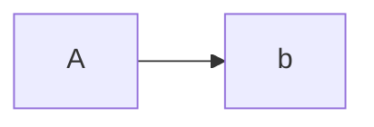
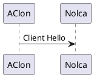
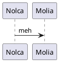

# Abstract

{#fig:img}

img如图[@fig:img]

mermaid如图[@fig:mermaid]。

uml如图[@fig:uml]。

# h1-mermaid

```mermaid
graph LR
    A --> b
```
: 美人鱼 {#fig:mermaid}

# h1-plantuml

```plantuml
@startuml
AClon -> Nolca: Client Hello
@enduml
```
: uml {#fig:uml}

```plantuml
@startuml
Nolca -> Molia: meh
@enduml
```
